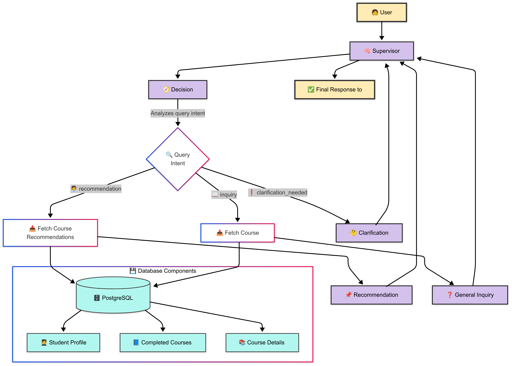

<h1>
  
  IU Smart Course Selector AI Application
</h1>

An intelligent tool designed to guide students in selecting courses that align with their academic goals. This system brings together advanced data search techniques, specialized processing modules, and a user-friendly interface to deliver personalized course recommendations and insights.

---

## Overview

The system combines three key elements:

1. **Data Integration:**  
   Course information is sourced directly from the [IU Data Catalog Search](https://sisjee.iu.edu/sisigps-prd/web/igps/course/search/).

2. **Smart Query Processing:**  
   A set of intelligent modules work together to understand student queries deeply and retrieve the most relevant course information.

3. **Interactive User Experience:**  
   Students can explore the course catalog, manage their personalized course list, and interact with a conversational assistant to refine their choices—all within an engaging, modern interface.

---

### Intelligent Query Handling by Multi-Agent System

When a student submits a query, the system processes it through several stages:

- **Central Coordination by Supervisor Agent**  
  Orchestrates workflow and delivers final responses

- **Query Analysis by Decision Agent:**  
  Evaluates whether the query seeks course recommendations, a general inquiry, or clarification of vague ideas.

- **Specialized Response Agents:**  
  - **Course Suggestion by Recommendation Agent:** Uses advanced search techniques to recommend courses tailored to the student’s career and academic profile.
  - **Detail Retrieval by Inquiry Agent:** Provides specific information about courses.
  - **Clarification Assistance provided by Clarification Agent:** Helps refine vague or ambiguous queries by prompting for additional details.

### Deep Data Understanding

Powered by a robust database with semantic search capabilities, the system not only matches keywords but also understands the context and meaning behind course data. This ensures that recommendations are truly relevant to each student's needs.

### Interactive Experience

The user interface offers an intuitive and engaging way to interact with the system:

- **Browse & Explore:**  
  Easily view a full course catalog complete with descriptions and prerequisites.  
  

- **Personal Course Management:**  
  Maintain a customized list of courses for upcoming semesters.  
  

- **Conversational Assistance:**  
  Chat with the system to receive recommendations, ask detailed questions, and add courses directly to your plan with a single click.  
  

---

### TechStack Used:

- **LangChain:** Used for the multi-agent framework.
- **Language Model:** Anthropic's claude-3-7-sonnet-20250219.
- **FastAPI:** For backend API integration.
- **PostgreSQL:** Stores data for student profiles, login information, course details, completed courses, my course list, and course trends.
- **pgvector:** Enables semantic search.
- **Frontend:** Built using React, Redux, Reducx Toolkit and TypeScript.

## In Summary

The Course Recommendation System is your smart academic companion. By combining reliable course data, advanced search capabilities, and a user-friendly interface, it helps you make well-informed decisions about your education. Whether you’re seeking tailored course suggestions, detailed course information, or guidance to clarify your academic path, this system is here to support your journey.

Happy learning!
